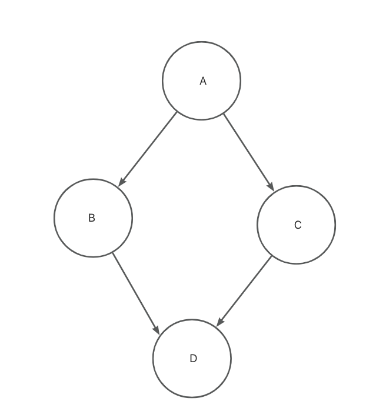
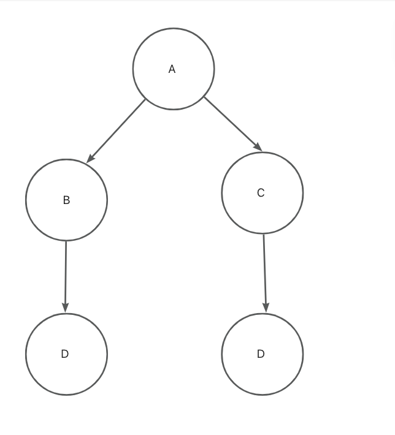
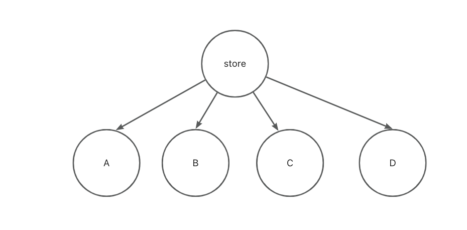
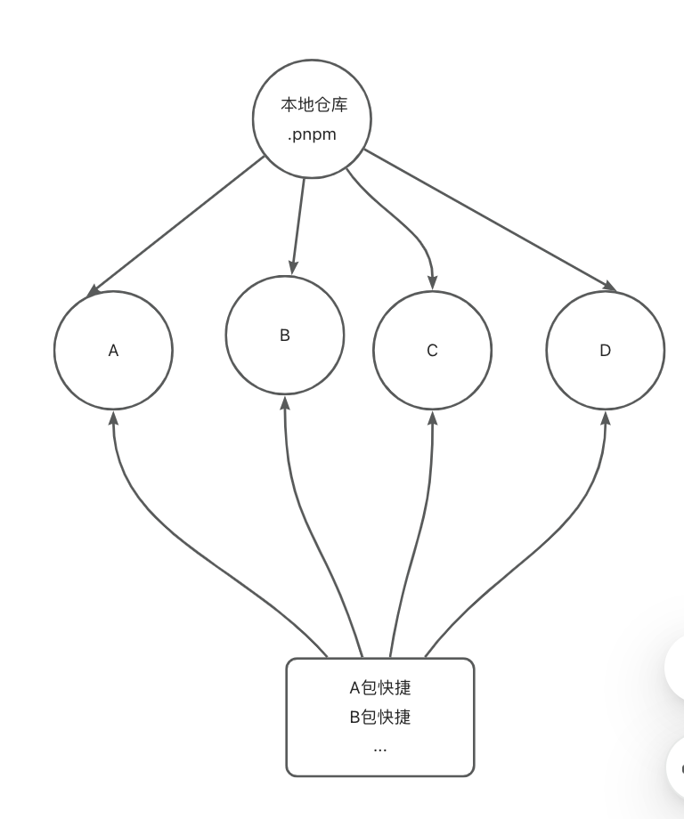

幻影依赖

理想依赖关系

## npm

文件树依赖

缺点: 磁盘空间大,安装重复的依赖包  
假设 A 包依赖 lodash 包, 项目 package.json 里面并没有声明 lodash,项目可以直接使用  
存在问题

- A 包升级,不存在 lodash,项目报错
- A 包依赖的 lodash 是 dev 依赖, prod 上不会打包进去,导致项目报错

## yarn

优点比 npm 节省磁盘  
yarn 的做法是把所有包在 node_modules 拍平(扁平化),但是依然会有上面的问题,看不出依关系,比 npm 的优点缩小了磁盘空间

## pnpm

最佳实现
pnpm 是把所有包拍平存储到磁盘仓库内, node_modules 依赖快捷方式指向仓库,这样不会存在幻影依赖问题

## 硬连接、软连接

敬请期待
